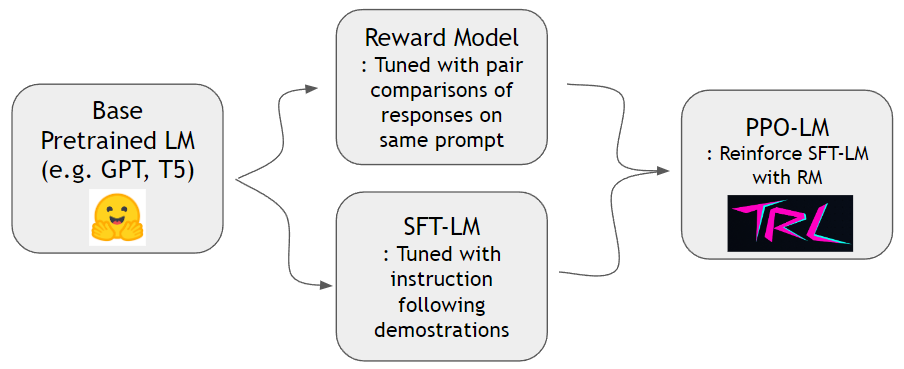

<a href="https://github.com/psf/black"></a>

# EasyRLHF
EasyRLHF aims to providing an easy and minimal interface to train RLHF LMs, using off-the-shelf solutions and datasets (i.e. HF Trainer, HF Datasets, Deepspeed, trl, peft and whatnot).

## Workflow
As shown in [InstructGPT paper](https://arxiv.org/abs/2203.02155), we can train a reward model and reinforce a language model to follow human instructions better. We can first train reward model and SFT-LM with hh-rlhf dataset and self-instruct dataset respectively. Then PPO-LM can be trained with trl and peft library.




### Train a Reward Model

we need pairwise comparison dataset to train a reward model. In the InstructGPT paper, authors used 4~9 ranked continuations on the same prompt. For instance, `A < B < C = D < E` is a ranked sequence and one can sample two arbitrary samples(A and C). Here, C wins over A on the human preference. Thus we model `logit of C - logit of A` to be the log odds of C being a better demonstration than A. `logit of X` can be computed by a linear head attached at the top of a transformer decoder. We use off-the-shelf dataset from [hh-rlhf](https://github.com/anthropics/hh-rlhf) by anthropic. This dataset is already flat so we don't need to worry about sampling schemes discussed in InstructGPT paper.

### Train a SFT(supervised finetuned) model (WIP)

We can train SFT model with standard next-token-prediction using [self-instruct dataset](https://github.com/yizhongw/self-instruct/tree/main/data). 

### Train a PPO model (WIP)

Now that we have a reward model and a SFT model, we can do reinforcement learning with off-the-shelf RL packages designed for language models (e.g. trl, trlx and RL4LMs). We use [trl](https://github.com/lvwerra/trl) and [peft](https://github.com/huggingface/peft) to reinforce the SFT model with parameter efficient manner(LoRA). 

----

## Quickstart

- Prepare virtual environment (optional)

```
conda create -n easy-rlhf python=3.8
```

- Clone and install requirements

```
git clone https://github.com/DaehanKim/EasyRLHF.git
cd EasyRLHF
pip install .
```

- Unzip hh-rlhf dataset and train a reward model by using `rm_train` cmd

```
cd data
find . -name '*.gz' -print0 | xargs -0 gzip -d
rm_train --devices "0,1,2,3" \
--output_dir "outputs/my-model" \
--train_data data/helpful-base/train.jsonl,data/helpful-online/train.jsonl,data/helpful-rejection-sampled/train.jsonl \
--valid_data data/helpful-base/test.jsonl,data/helpful-online/test.jsonl,data/helpful-rejection-sampled/test.jsonl
```

- Alternatively, you can use `scripts/rm_train.sh` for more customized settings

### Notes
- Default model is gpt2-xl(1.5B) and the loss is binary cross entropy.
- Deepspeed config is in `configs/ds_config.yaml` where you can set your preferred distributed setting. Default is set to Zero-2 Parallelism.
- ToDo
  - [x] basic reward model training
  - [ ] basic SFT model training
  - [ ] basic PPO model training
  - [ ] language expansion using translated datasets

## References
- [InstructGPT paper](https://arxiv.org/abs/2203.02155)
- [trl](https://github.com/lvwerra/trl)
- [hh-rlhf](https://github.com/anthropics/hh-rlhf)
- [self-instruct](https://github.com/yizhongw/self-instruct/tree/main/data)

## License

This project just binds libraries and datasets from various sources, so is under license terms of corresponding sources. 
Binding script itself is licensed MIT.